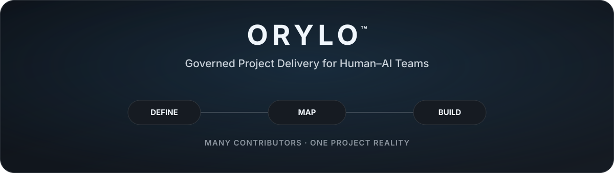
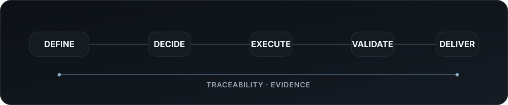

  

**A governed workspace for keeping complex projects coherent across people, AI, decisions, execution, and delivery.**

 

## Shared Project Reality

Complex projects distribute knowledge, decisions, and execution across people, tools, and AI. Orylo keeps those contributors aligned around one persistent understanding of the project — what is being built, what is currently valid, and where each contribution belongs.

 

# The Orylo Idea

Orylo does not treat a project as a collection of tasks.

A project is an interconnected system of **intent, knowledge, decisions, product structure, responsibility, execution, evidence, and delivery**. When those elements become disconnected, even technically strong execution can drift away from the product that was meant to be built.

Orylo brings them into one governed environment so the project can remain **coherent, controlled, and traceable** as it moves from definition into real delivery.

 

# What Orylo Enables

| Capability | What it enables |
|---|---|
| **Shared Project Intelligence** | A persistent understanding of the project that survives individual people, sessions, tools, and AI systems. |
| **Structured Product Delivery** | A deliberate path from project understanding into product structure, architecture, execution, and delivery. |
| **Human–AI Collaboration** | Humans and AI contributing to the same project without making responsibility or authority ambiguous. |
| **Governed Execution** | Work that stays aligned with valid project state, defined responsibility, and approved direction. |
| **Continuous Knowledge** | Project understanding that does not need to be reconstructed when contributors or tools change. |
| **Traceable Delivery** | Decisions, changes, implementation, validation, evidence, and outcomes remaining connected over time. |

 

# From Intent to Delivery

Every project begins before code: with **a need, a problem, an idea, or a human intent**.

Orylo helps that intent become progressively clearer, more structured, and more executable.

<table>
<tr>
<td width="33%" valign="top">

### Define

Understand the project.

Clarify the problem, goals, constraints, needs, and project identity until reliable downstream decisions can be made.

</td>
<td width="33%" valign="top">

### Map

Shape the product and system.

Bring experience, structure, relationships, and architecture into one coherent model before heavy execution begins.

</td>
<td width="33%" valign="top">

### Build

Execute with intent.

Turn approved understanding into planning, implementation, validation, evidence, and delivery.

</td>
</tr>
</table>

**Understand first. Structure second. Execute with intent.**

 

# Human + AI Collaboration

Orylo is designed for environments where humans and AI can both participate in real project work.

AI may contribute to research, analysis, design, documentation, implementation, review, and other activities. But contribution and authority remain distinct.

> **Execution capability is not the same as decision authority.**

Responsibility, scope, and authority can be defined independently from the type of contributor performing the work. This allows different human and AI actors to collaborate without making project ownership or accountability ambiguous.

 

# Governed Execution

Orylo is concerned with more than whether work was completed.

**Right Work · Right Scope · Valid Project State · Explicit Authority**

The goal is to keep execution connected to product meaning, current project truth, and defined responsibility — so speed does not come at the cost of coherence or control.

 

# Traceable, Evidence-Backed Delivery

A reliable project should be able to explain not only **what exists now**, but **why it arrived there**.

Orylo is designed to preserve the relationship between decisions and outcomes, so project history can remain understandable rather than becoming only a sequence of disconnected changes.

Delivery is therefore more than a status. The work, validation, and resulting outcome should remain connected strongly enough to support review, accountability, and evidence.

 

# What Makes Orylo Different

| Conventional project tooling often centers on | Orylo also preserves |
|---|---|
| Tasks and schedules | **Project knowledge and continuity** |
| Assignment | **Responsibility, scope, and authority** |
| Current status | **Decision and change traceability** |
| Completion | **Validation and evidence** |
| Individual tools or sessions | **A shared project reality across contributors** |

Orylo extends project management toward **project governance**: keeping execution aligned with what is currently true about the project.

 

# A Platform for Governed Delivery

Orylo brings project workspace, product development flow, human–AI collaboration, governance, and traceability into one shared system.

It is designed to support both new and existing projects — from the point where the problem and product still need to be understood through real implementation and delivery.

> **Orylo keeps the project coherent while people, tools, decisions, and implementations change around it.**

 

## Current Status

**Active Product Development**

Orylo is under active development as a dedicated governed delivery workspace with an independent product model.

Current work focuses on workspace experience, project flow, product mapping, governance, human–AI collaboration, and end-to-end delivery continuity.

 

<strong>Technology, Public Scope & Proprietary Boundary</strong>

 

### Technology-Independent at the Product Level

Orylo is not defined by a particular AI provider, model, IDE, or execution tool.

Models, agents, and development environments can change. Orylo preserves the structure of collaboration, project truth, responsibility, and delivery continuity across those changes.

### Public Scope

This repository presents Orylo's public product layer: product vision, problem and value, core capabilities, human–AI collaboration, structured delivery, governance concepts, and selected product architecture.

Internal orchestration logic, execution contracts, schemas, routing logic, governance internals, guards, taxonomies, and other proprietary operating mechanisms remain private.

 

---

### Designed & Developed by [Ali Alavi](https://github.com/alaviarts)

**Product & Systems Architect**

 

**Orylo™**

**© 2026 Ali Alavi. All rights reserved.**

 

*Many contributors. One project reality.*

